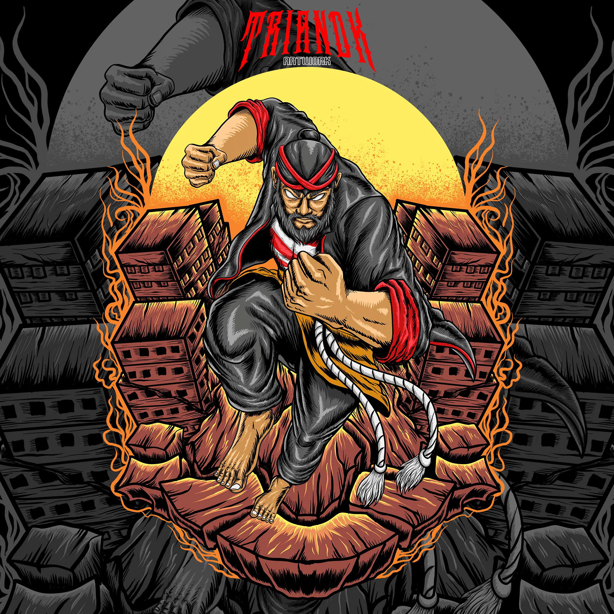
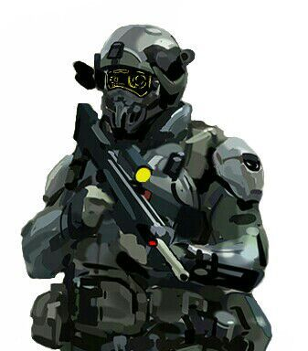

# Nusantara Dungeon
A discord bot that actually an interactive text based dungeon crawler game 

# Story
In the midst of the pandemic, the Indonesian Meteorology Agency was caught off guard when a mysterious object that resembled a meteor was hurtling towards Earth. Experts predicted that it would crash onto the island of Kalimantan in just three days, yet the government officials were indifferent to the potential danger and chose to ignore the warnings.

Several days later, the strange object indeed plummeted into the middle of the forest, causing a stir among locals. The experts pleaded with the government to send a team to investigate, as the object was surrounded by an eerie dark aura. However, the officials continued to brush off the experts' concerns and forbade them from entering the area.

Weeks passed without any official action, and a strange phenomenon began to occur. The forest surrounding the crash site began to transform, taking on the characteristics of an otherworldly dungeon. Locals began to disappear without a trace, and rumors began to circulate of terrifying supernatural creatures that were now roaming the area. Despite mounting evidence of a looming threat, the government still refused to intervene.

Eventually, the situation became too dire to ignore, and the government finally relented, allowing the experts to investigate the mysterious object and the strange occurrences happening in the forest. After gathering terrifying information about the dangers of the dungeon, the government resorted to an unconventional solution. They launched a competition to conquer the dungeon, promising a handsome reward for anyone who could destroy or secure the energy core of the meteorite that had caused the bizarre transformation. The competition drew brave adventurers from all over, eager to claim the prize and put an end to the dangerous situation that the government had stubbornly allowed to fester.

# Character
- Raden Mandala

Raden Mandala was the king of the prosperous kingdom of Mandala Raya in Kalimantan. He was a just and beloved ruler who worked tirelessly to ensure the welfare of his people, providing them with jobs, food, healthcare, and education. His subjects revered him for his great deeds, and he was admired throughout the region.

One night, Raden Mandala saw a strange meteoroid in the sky, heading towards a nearby forest where villagers lived. Although he was curious about it, he hesitated to investigate, not wanting to burden his soldiers who were already tired from their day's work. But that night, he had a vision that the meteoroid contained great power that could endanger his people.

The next day, he called upon his bravest soldiers to accompany him to the forest. As they approached the edge of the forest, they were attacked by a group of terrifying ghost monsters that had emerged from the dungeon hidden deep within the forest. The soldiers fought valiantly, but the monsters were too strong, and they were unable to move forward.

Raden Mandala, determined to protect his people, knew he had to act fast. He ordered his soldiers to keep the monsters occupied while he snuck past them and ventured into the dungeon alone.

- Indrayani

Indrayani was a powerful shaman who lived near the peak of Mount Jaya Wijaya. He was known for his ability to communicate with spirits and harness their supernatural powers. Over the years, he had predicted many significant events, both good and bad, for the benefit of his own knowledge and reputation.

One day, while meditating, Indrayani received a vision that a strange object from the sky would crash in the dense forests of Kalimantan. He saw that this object carried immense power that could change the course of history, and he felt a strong urge to be part of it.

As the events unfolded, Indrayani followed the news of the object's landing and the government's stubbornness in dealing with it. He realized that the object was indeed a meteorite and that it contained a unique energy that he could harness to become even more powerful.

Determined to be part of this historic event, Indrayani decided to join the competition to conquer the dungeon. He believed that by reaching the meteorite and absorbing its energy, he could elevate his abilities to new heights and become one of the most powerful shamans in Indonesia.
- Rastra Sewakotma

Rastra Sewakotma was the highest-ranking military commander leading the government's special forces unit called NAYAKALARA. The government sent Rastra and his team to escort BMKG scientists to monitor the dungeon in Kalimantan. Upon arrival, they were stunned by the presence of many ghosts. Tuyul, Wewe Gombel, Buto Ijo, Kuyang, Kunthilanak, all the demons they knew were right in front of them. They were too scared and overwhelmed, and one of Rastra's team members screamed in terror, causing the demons to notice and fixate on their presence.

The demons began running towards the scientists and special forces with their terrifying appearances and bloodthirsty gaze. Rastra and his team opened fire at the demons, giving instructions to the scientists to flee. However, their weapons were useless against the demons. Although they managed to hit them, the impact seemed to have no effect. Meanwhile, the scientists had already managed to escape to the main base.

In terror and guilt, Rastra realized that he needed to inform the government about the terrifying situation they encountered in the dungeon. He ran back to the main base and reported everything he saw. The government refused to believe his story and ordered him to keep quiet about it, citing the potential negative impact on national security.

Haunted by guilt for not being able to save his team members and for being forced to keep silent, Rastra became obsessed with seeking revenge on the demons. He spent months researching and gathering information about the demons and their weaknesses, preparing himself for the day he would face them again. Eventually, he learned about a competition being held to conquer the dungeon, and he saw this as his chance to finally seek redemption for his team members' deaths.

- Pandung Cora

Padung Cora was a notorious thief who had made a name for himself across Indonesia for his skillful and audacious heists. From the bustling streets of Jakarta to the remote corners of Papua, Padung had managed to acquire an impressive collection of artifacts that once belonged to ancient kingdoms and powerful rulers.

One of his most impressive scores was the uncal necklace from the Kutai kingdom, the sutasuma book from the Majapahit kingdom, and the Cakra Donya Bell from the Samudra Pasai kingdom. These national treasures were meant to be protected and preserved for future generations, but Padung's insatiable greed had led him to steal them, much to the dismay of the Indonesian people.

Despite the risks involved, Padung always sought out his next big score. It was during one of his scouting missions that he heard about a dungeon-conquering competition in Kalimantan. The mere thought of it sent a shiver down his spine and a wicked smile to his face. He knew he had to enter the competition, not just for the thrill of it but for the chance to claim a new prize.

As he watched the TV screen with an intense gaze, Padung knew that he had found his next target. The competition may have been tough, but Padung was a master of his craft, and he was confident that he could outsmart anyone who dared to stand in his way. For Padung Cora, the world was his playground, and nothing could stop him from getting what he wanted.

# Enemy
- Kuyang

Merupakan setan berwujud kepala manusia dengan isi tubuh yang menempel tanpa kulit dan anggota badan yang dapat terbang untuk mencari darah bayi atau darah wanita setelah melahirkan. Makhluk ini dikenal masyarakat di Kalimantan. Kuyang diceritakan sebagai manusia (wanita) yang menuntut ajaran ilmu hitam untuk mencapai kehidupan abadi.

- Sundel Bolong

Merupakan setan berwujud wanita cantik berambut panjang dan bergaun panjang warna putih yang bolong ("berlubang tembus") di bagian punggung yang sedikit tertutup rambut panjangnya sehingga organ-organ tubuh bagian perut terlihat.

- Tuyul

Merupakan setan berwujud orang kerdil atau anak kecil dengan kepala gundul, yang dipercaya dapat mencuri uang untuk tuannya.

- Wewe Gombel

Merupakan setan yang suka menculik anak-anak yang ditelantarkan dan diabaikan oleh orang tuanya, tetapi tidak mencelakainya.

- Leak

Merupakan setan yang bisa menggunakan ilmu untuk berubah menjadi Rangda,Bade (tempat mayat/tulang manusia saat ngaben),Page (kranda dari ulatan bambu kadang beserta petinya), atau Binatang yang digunakan untuk tameng badan ataupun untuk menyerang musuh-musuh

- Jenglot

Merupakan setan berbentuk seperti boneka dengan ciri-ciri berkulit gelap dengan tekstur kasar (seperti mumi), berwajah seperti tengkorak dan bertaring mencuat serta memiliki rambut dan kuku yang panjang.

- Babi Ngepet
- Kuntilanak
- Jeruk Purut
- Jurig Bonge
- Buto Ijo (**boss**)
- Genderuwo (**boss**)
- Banaspati (**boss**)
- Rangda (**boss**)
- Nyi Roro Kidul (**boss**)

# Gameplay
It's just turn based game, inspired by slay the spire, but without cards. You will be given 4 option of character with their unique weapons and abilities. Kill ghosts in your journey and beat the dungeon.
Mainly you will interacting with embedding message, using provided reactions.

# Features

# Technical

# Advice
